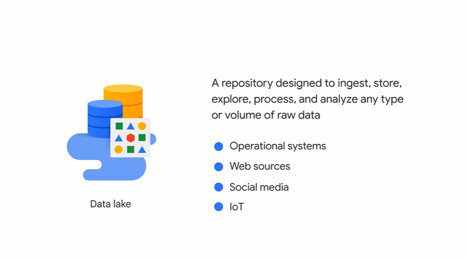
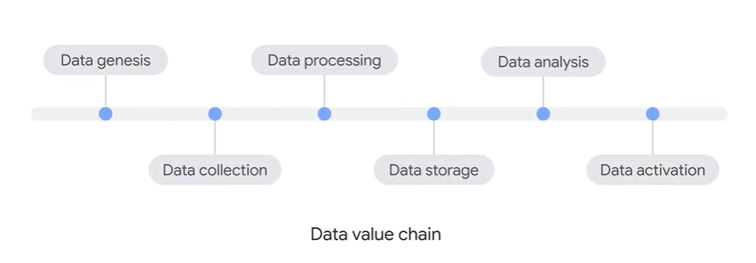

# unlocking buissness value for data

types of data:
- structured data (spreadsheets or database)
- semi-structured data (html,json,xml)
- unstructred data (text,datafiles(audio,video),logs)

# Datamanagement Concept

- relational database(sql) => tablular format,structured format, query using sql
- non-relational database(no sql) => non-tablular format,un-structured format, follow flexible data model

```Cloud SQL``` and ```spanner``` are relational db
```Bigtable``` is non-relational db

# datawarehouse

use for buissness intelligent, hold both structred and unstructured data

```BigQuery``` if GCP's Datawarehouse

# datalake



# Understand and Analyze

1.Structured data - Cloud SQL,Spanner,Bigquery
2.semi-structred data - Bigtable,Datastrore
3.unstructured data - Cloud Storage

# Role of data in digital transformation

- Firstparty data => data collects from customer/auidence of transaction or interaction
- Secondparty data => from firstparty data(another org) data that can be augmented for company internal data
- thirdparty data => Dataset that collected and managed by organization that don't directly intract with org's customers or buissness (Govt,non-profit,academic sources)

# Data value Chain



# data Storage

1.cloud Storage
2.Cloud Sql
3.spanner
4.Big Query
5.Firestore
6.Bigtable

## cloud Storage

there are four primary storage:

1.standard storage - (fequent access or hot data)
2.nearline storage - (per month, data backups)
3.coldline storage - (once every 90 days)
4.Archive Storage - (once a year)

## Cloud SQL
fully managed relational databases like,
- mysql
- PostgresSQL
- SQL Server

The Database migration(DMS) is easier , production database to cloudsql with minimal downtime.

## Spanner
- fully managed relational database with unlimited scale, string consistency
- High Availability across globe(will replicate data on global or geo-redundancy)
- Handles Replica, Sharding and transaction processing.

## Bigquey
- fully managed datawarehouse
- provides Storage and Analytics

## Firestore
- Semi-structure db, flexible, Horizontal Scalable
- No sql db
- offline usage(connect from local) 

## Bigtable
- No sql big data service
- Handles masice workloads
