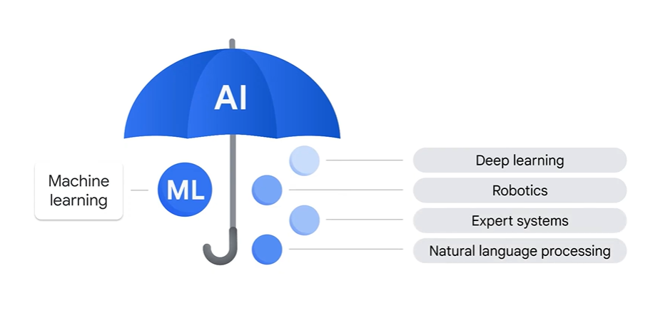

# Innovating with Google Cloud Artificial Intelligence

One helpful way to remember the difference between the two is to imagine them as umbrella categories.

AI - Artificial intelligence is the overarching term that covers a variety of specific approaches and algorithms.

ML - Machine learning sits beneath that umbrella, but so do other major sub fields such as deep learning, robotics, expert systems, and natural language processing.

usecase:
Maya the person who solves and gain values for the air lines company, where she uses ML to predict and Analyze the Insights of the each plane , the factors are timings of plane , customer compliance and satisfaction and weather reports of flight etc..

# ML Options on Google Cloud

1.BigQuery ML
2.Pre-trained APIs
3.AutoML
4.Custom training

## BigQuery ML
