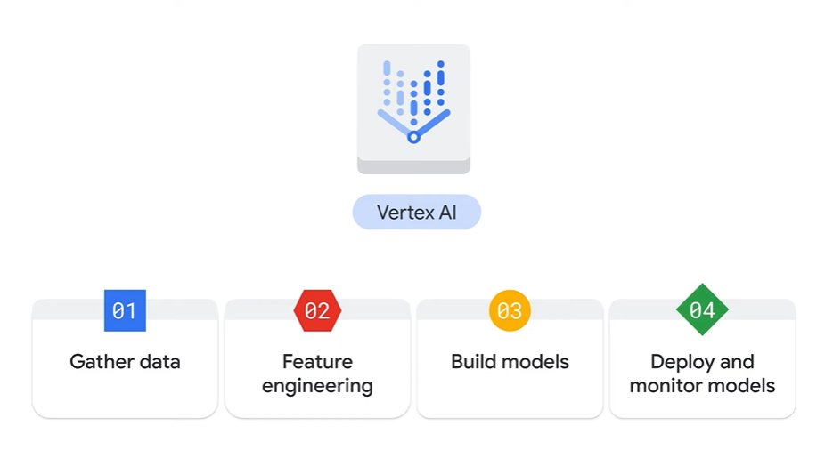
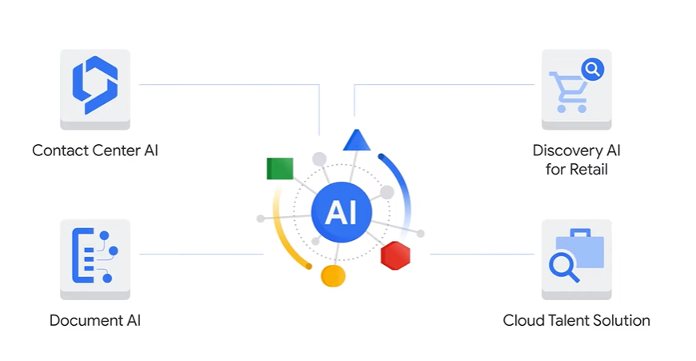

# Innovating with Google Cloud Artificial Intelligence

One helpful way to remember the difference between the two is to imagine them as umbrella categories.

AI - Artificial intelligence is the overarching term that covers a variety of specific approaches and algorithms.

ML - Machine learning sits beneath that umbrella, but so do other major sub fields such as deep learning, robotics, expert systems, and natural language processing.

usecase:
Maya the person who solves and gain values for the air lines company, where she uses ML to predict and Analyze the Insights of the each plane , the factors are timings of plane , customer compliance and satisfaction and weather reports of flight etc..

# ML Options on Google Cloud

1.BigQuery ML
2.Pre-trained APIs
3.AutoML
4.Custom training

## BigQuery ML

- model are trained directly in bigquery using sql
- integrates with vertex AI
- When BigQuery ML models are registered to the Vertex AI model registry, they can be deployed to endpoints for online prediction.

## Pre-trained APIs

- Vision API(images), NLP API(text), Cloud Translation API(one language to another)
- Speech-to-text API (audio to text), Text-to-Speech (text into high quality voice audio)
- Video Intelligence API (motiona and action in video)

## Auto ML

- AutoML and Vertex AI lets you build and train machine learning models from end to end by using graphical user interfaces.
- Often referred to as GUIs without writing a line of code.

## Custom model

- Vertex AI is also the essential platform for creating custom end to end machine learning models.
- means not only are models trained with your own data, but the models are custom built as well.

## Tensorflow

- TensorFlow has a flexible ecosystem of tools, libraries, and community resources that enable researchers to innovate in ML and developers to build and deploy ML powered applications.

## AI Solutions

Beyond the customizable options, Google Cloud has also created a set of full AI solutions aimed to solve specific business needs.

### Contact Center AI

- Contact Center AI provides models for speaking with customers and assisting human agents, increasing operational efficiency, and personalizing customer care to transform your contact center.

### Document AI

- Document AI unlocks insights by extracting and classifying information from unstructured documents such as invoices, receipts, forms, letters, and reports.
- The extracted data can then be saved in a database or exported to another application for further analysis.

### Discovery AI for Retail

- Discovery AI for retail uses machine learning to select the optimal ordering of products on a retailer's e-commerce site when shoppers choose a category like winter jackets or kitchen ware.
- Over time, the AI learns the ideal product ordering for each page on the site by using
- historical data, optimizing how and what products are shown for accuracy, relevance, and likelihood of making a sale.

### Cloud Talent Solution

- Cloud Talent Solution uses AI with job search and talent acquisition capabilities, matches candidates to ideal jobs faster, and allows employers to attract and convert higher quality candidates.