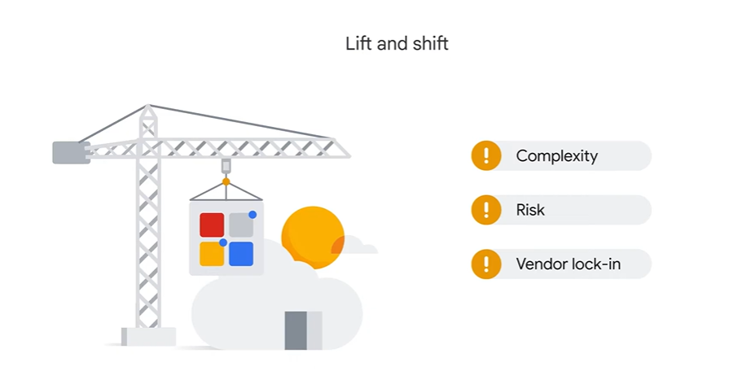

# Modernize Infrastructure and Applications with Google Cloud

## Important cloud migration terms

- Workload:

In Cloud computing, a workload is a specific application, service, or capability that can be run in the Cloud or on premises.
Workloads include containers, databases, and virtual machines.

Retired:
sometimes workload can be retired
A workload might be retired because it's unnecessary, not cost effective, secure, or compatible with a specific platform.

Retained:
Alternatively, workloads are often retained.
When a workload is retained, it's typically kept on premises or in a hybrid Cloud environment.

Rehosted:
Rehost refers to the migration of a workload to the Cloud without changing anything in the workload's code or architecture.
This process is often referred to as lift and shift.

Replatformed:
In Cloud computing, replatform refers to the process of migrating a workload to the Cloud while making some changes to the workloads code or architecture.
This process is often called move and improve.

refactored:
Sometimes workloads are refactored, which refers to the process of changing the code of a workload.

reimagineD:
Cloud modernization can inspire and incentivize organizations to reimagine.
In Cloud computing, reimagine refers to the process of rethinking how an organization uses technology to achieve its business goals.

# VM

Virtualization is a form of resource optimization that lets multiple systems run on the same hardware.
These systems are called virtual machines or VMs.

Preemptible VMs:
less features
Preemptible VMs can only run for up to 24 hours at a time

Spot VMs:
more features
Spot VMs don't have a maximum runtime.

same pricing for both.

# Containers

- They provide isolated environments to run software services and optimize resources from one piece of hardware.
- Containers can run virtually and anywhere, which makes development and deployment easy.

## VMs vs Containers

- The key difference between virtual machines and containers is that virtual machines virtualize an entire machine down to the hardware layers.
- Whereas containers only virtualize software layers above the operating system level.

# managing Containers

Kubernetes, originally developed by Google, is an open-source platform for managing containerized workloads and services.

- Google Kubernetes Engine or GKE is a Google hosted, managed Kubernetes service in the Cloud.

- The GKE environment consists of multiple machines, specifically compute engine instances grouped to form a cluster.

- GKE clusters can be customized, and they support different machine types, numbers of nodes, and network settings.

- GKE makes it easy to deploy applications by providing an API and a Web based console.

- Applications can be deployed in minutes and can be scaled up or down as needed.

- GKE also provides many features that can help monitor applications, manage resources, and troubleshoot problems.

In summary, GKE is ideal when lots of control is required over a Kubernetes Environment and there are complex applications to run.
Alternatively, Cloud Run is ideal for when a simple, fully managed serverless platform that can scale up and down quickly is required.

## Rehosting legacy application from on-prem to cloud provider

The first is Google Cloud VMware Engine, which  helps migrate existing VMware workloads to the cloud without having to rearchitect  the applications or retool operations.
With Google Cloud VMware Engine, organizations can maintain their existing VMware environments and operational processes while ,

- benefiting from the scalability, security, reliability of Google Cloud.

- And for organizations with legacy applications on Oracle, Google Cloud offers Bare Metal Solution.