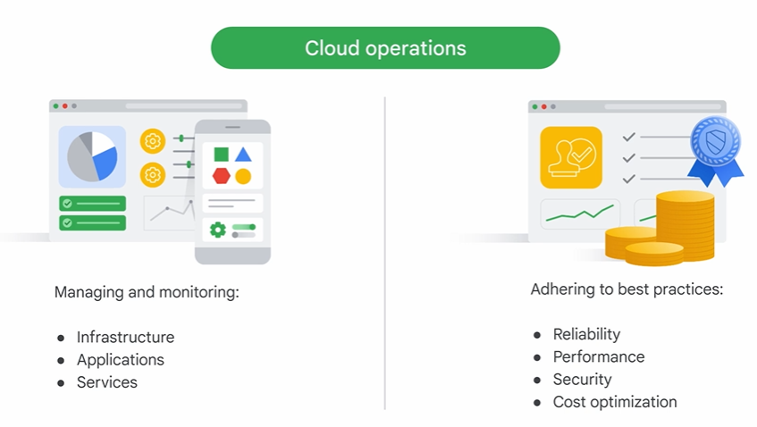
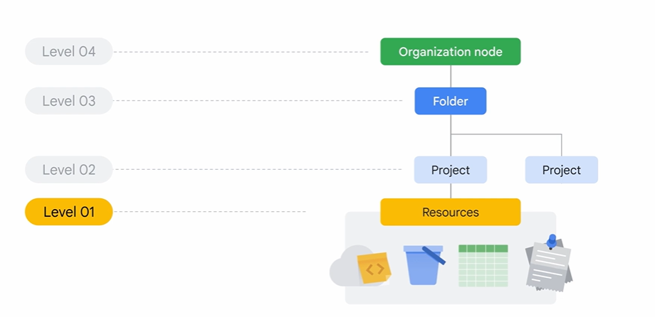
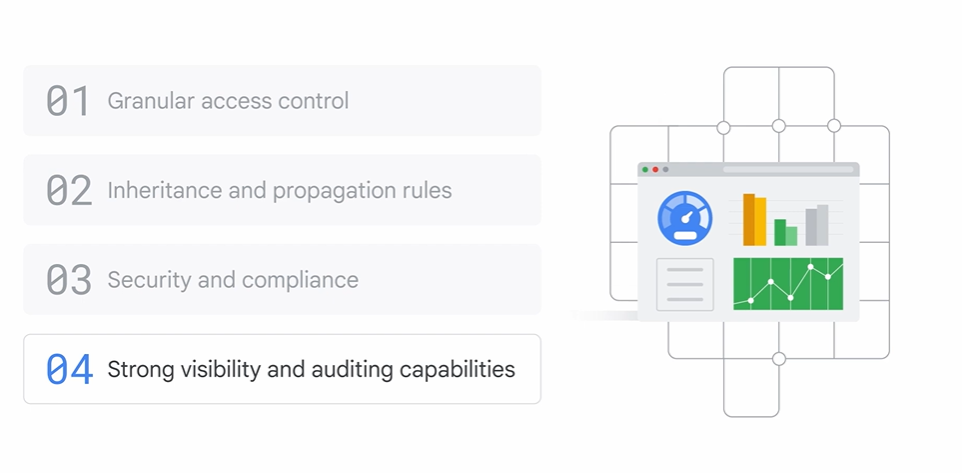

# Scaling with Google Cloud Operations

To manage cloud costs effectively, a partnership across finance, technology, and business functions is required.

# Using the resource hierarchy to control access

A policy is a set of rules that define who can access a resource and what they can do with it.
Policies can be defined at the project, folder, and organization node levels.

additional benefits of using it to control access to cloud resources.

# Fundamentals of cloud reliability

There are “Four Golden Signals” that measure a system’s performance and reliability.
They are latency, traffic, saturation, and errors.
