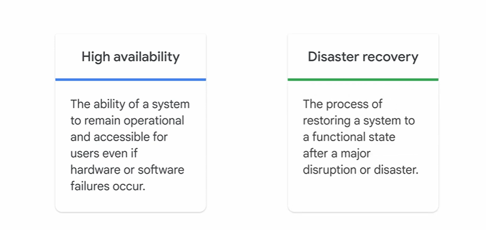

# Scaling with Google Cloud Operations

To manage cloud costs effectively, a partnership across finance, technology, and business functions is required.

# Using the resource hierarchy to control access

A policy is a set of rules that define who can access a resource and what they can do with it.
Policies can be defined at the project, folder, and organization node levels.

additional benefits of using it to control access to cloud resources.

# Fundamentals of cloud reliability

There are “Four Golden Signals” that measure a system’s performance and reliability.
They are latency, traffic, saturation, and errors.

Three main concepts in site reliability engineering are service-level indicators (SLIs), service-level objectives (SLOs), and service-level agreements (SLAs).

# Designing resilient infrastructure and processes

When infrastructure and processes in a cloud environment are designed, they need to be resilient, fault-tolerant, and scalable, for high availability and disaster recovery.

## some of the key design considerations and their significance in more detail:

- Redundancy refers to duplicating critical components or resources to provide backup alternatives.

- Replication involves creating multiple copies of data or services and distributing them across different servers or locations.

- Cloud service providers offer multiple regions or data center locations spread across different geographic areas.

- Building a scalable infrastructure allows organizations to handle varying workloads and accommodate increased demand without compromising performance or availability.

- Regular backups of critical data and configurations are crucial to ensure that if data loss, hardware failures, or cyber-attacks occur, organizations can restore their systems to a previous state.

## some of the managed services that constitute Google Cloud Observability.

### Cloud Monitoring:

- It collects metrics, logs, and traces from your applications and infrastructure, and provides you with insights into their performance, health, and availability.

- It also lets you create alerting policies to notify you when metrics, health check results, and uptime check results meet specified criteria.

### Cloud Logging:

- collects and stores all application and infrastructure logs.

- With real-time insights, you can use Cloud Logging to troubleshoot issues, identify trends, and comply with regulations.

### Cloud Trace 

- helps identify performance bottlenecks in applications.

- It collects latency data from applications, and provides insights into how they’re performing.

### Cloud Profiler

Cloud Profiler identifies how much CPU power, memory, and other resources an application uses.