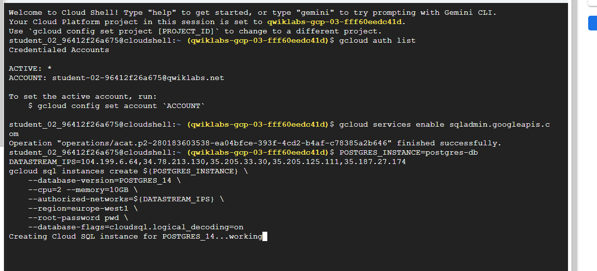
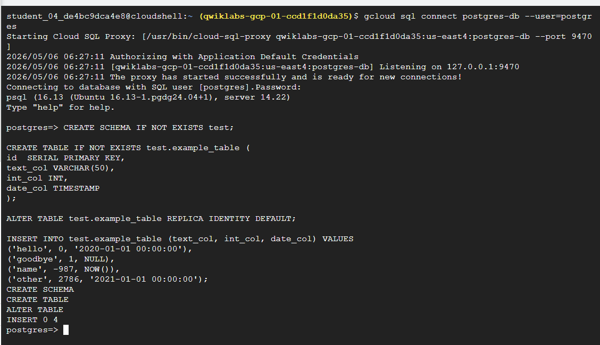
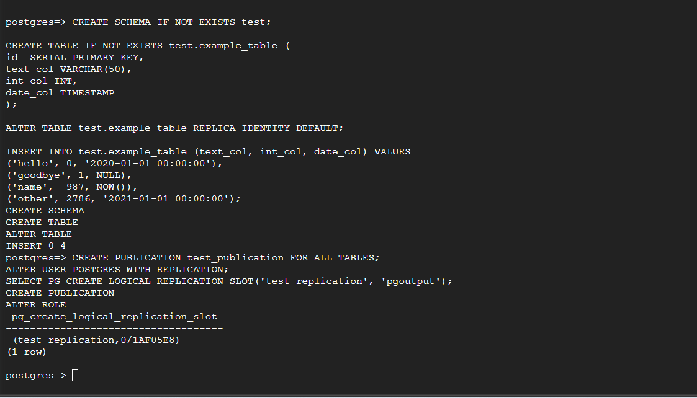
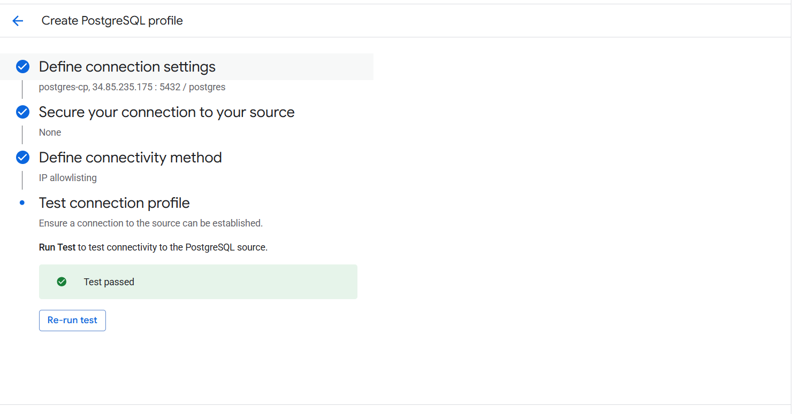
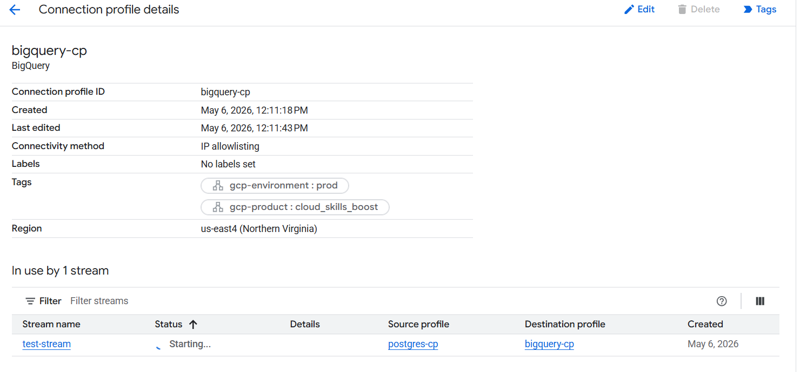
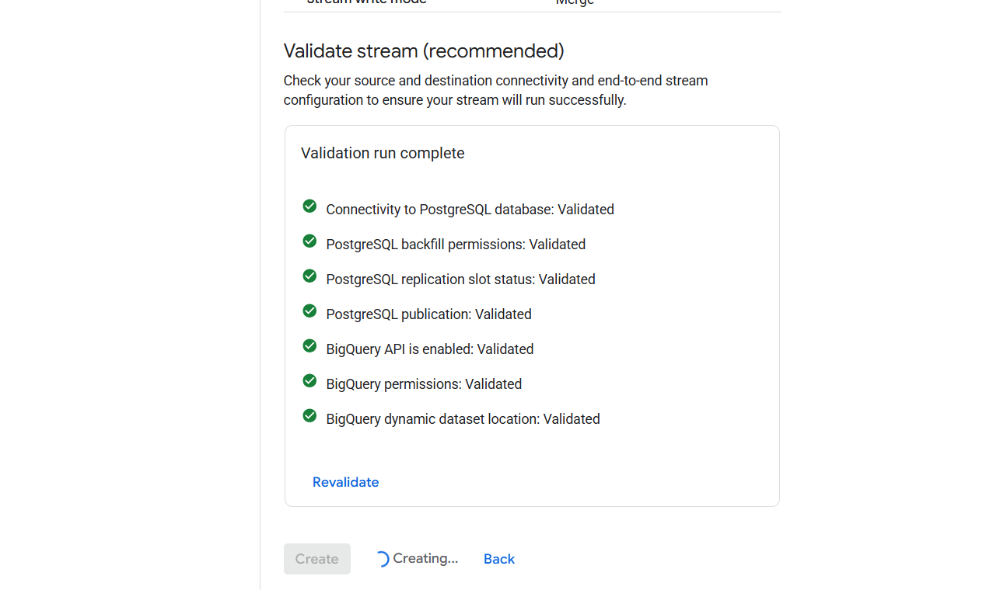
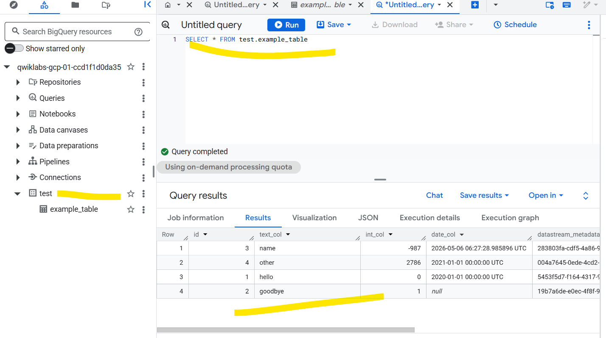

## Role of Data Engineer:

1.Replicate and Migrate - Tasfer the Raw data into Google Cloud
2.Ingest - Raw data is available in a data source
3.Transform - Process the data using EL or ELT or ETL.
4.store - processed data is available in sink.

### Replicate and Migrate:

on-premis to google cloud
service like,
- gcloud storage (smaller size of data)
- Transfer Appliance (larger size of data)
- Storage Transfer Service (medium size of data)
- Datastream

## The Task level 1:

### sub-1
1.Launched the gcloud lab
2.opened BigQuery and created dataset named "nyctaxi"
3.create table in nyctaxi using fileformat of csv, table name: "2018trips"
4.used google console cmd,

```shell
bq load \
--source_format=CSV \
--autodetect \
--noreplace  \
nyctaxi.2018trips \
gs://cloud-training/OCBL013/nyc_tlc_yellow_trips_2018_subset_2.csv
```

to append the data into existing table.

### sub-2
1.Launched the gcloud lab
2.created sub table from existing table "2018trips" as january_trips

#standardSQL
CREATE TABLE
  nyctaxi.january_trips AS
SELECT
  *
FROM
  nyctaxi.2018trips
WHERE
  EXTRACT(Month
  FROM
    pickup_datetime)=1;

## The Task level 2:

### sub-2 
Create a database for replication

1.Run the following command to enable the Cloud SQL API:

```shell
gcloud services enable sqladmin.googleapis.com
```

2.Run the following command to create a Cloud SQL for PostgreSQL database instance:

```shell
POSTGRES_INSTANCE=postgres-db
DATASTREAM_IPS=104.199.6.64,34.78.213.130,35.205.33.30,35.205.125.111,35.187.27.174
gcloud sql instances create ${POSTGRES_INSTANCE} \
    --database-version=POSTGRES_14 \
    --cpu=2 --memory=10GB \
    --authorized-networks=${DATASTREAM_IPS} \
    --region=europe-west1 \
    --root-password pwd \
    --database-flags=cloudsql.logical_decoding=on
```

Note: This command creates the database in europe-west1. 





Configure the database for replication
Run the following SQL command to create a publication and a replication slot:

```shell
CREATE PUBLICATION test_publication FOR ALL TABLES;
ALTER USER POSTGRES WITH REPLICATION;
SELECT PG_CREATE_LOGICAL_REPLICATION_SLOT('test_replication', 'pgoutput');
```



### sub-3
Create the Datastream resources and start replication

Create connection profiles
Create two connection profiles, one for the PostgreSQL source, and another for the BigQuery destination.

#### PostgreSQL CP - (Connection Profile)



#### Bigquery CP - (Connection Profile)



#### Create Stream:




#### sub-4 (View the data in BigQuery)



#### sub-5 (Check that changes in the source are replicated to BigQuery)

1.Run the following command in Cloud Shell to connect to the Cloud SQL database (the password is pwd):

```shell
gcloud sql connect postgres-db --user=postgres
```

2.Run the following SQL commands to make some changes to the data:

```shell
INSERT INTO test.example_table (text_col, int_col, date_col) VALUES
('abc', 0, '2022-10-01 00:00:00'),
('def', 1, NULL),
('ghi', -987, NOW());

UPDATE test.example_table SET int_col=int_col*2; 

DELETE FROM test.example_table WHERE text_col = 'abc';
```

3.Open the BigQuery SQL workspace and run the following query to see the changes in BigQuery:

```shell
SELECT * FROM test.example_table ORDER BY id;
```
