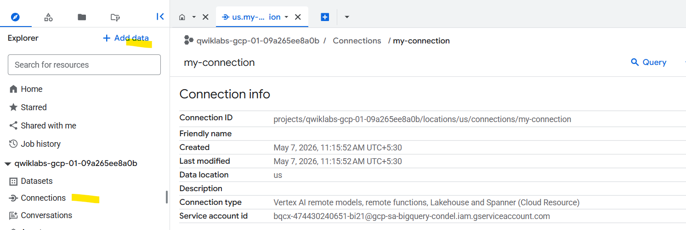
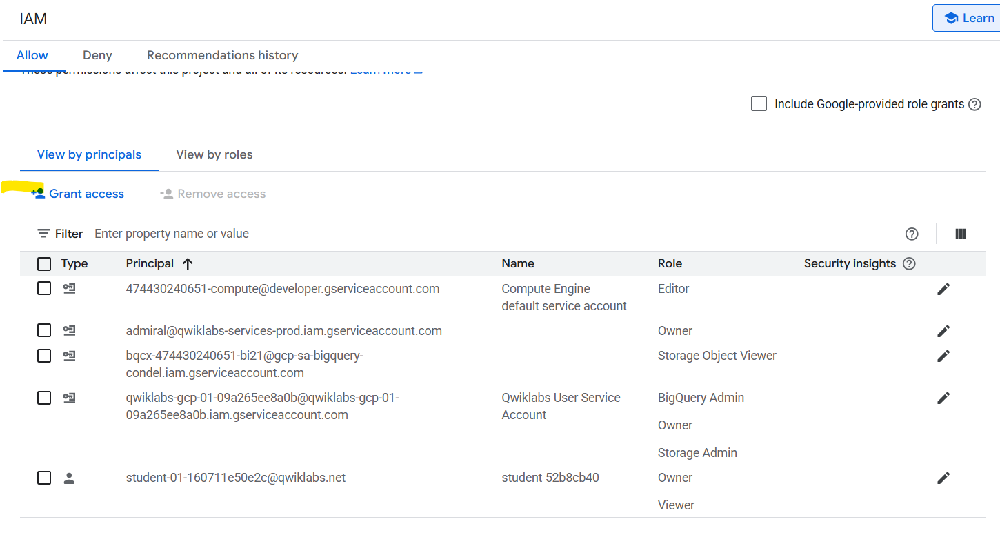
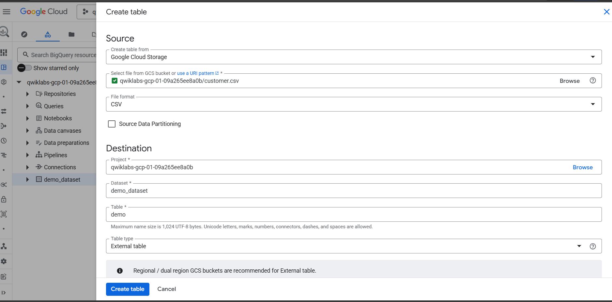
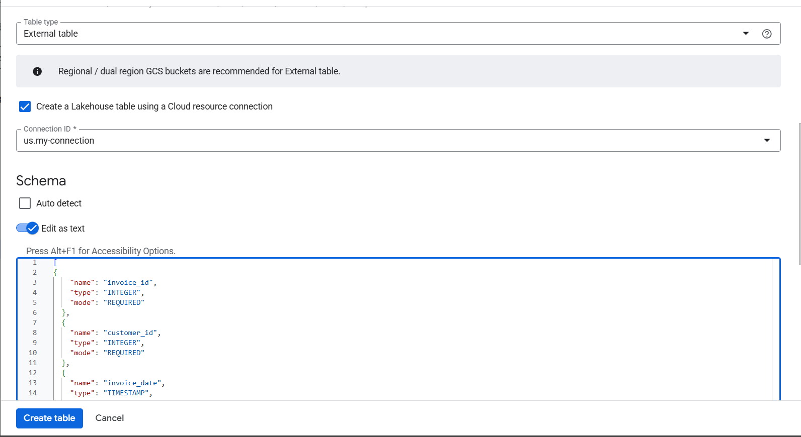

## Extract Load pipeline pattern

1.bq load
2.External tables
3.Data Transfer Service
4.External Tables (BigLake)

## bq load

Intract with BigQuery by using the bq command

```shell
bq mk --location=US -dataset dataset-name
```

```shell
bq load \
--source_format=CSV \
--skip_leading_rows=2 \
dataset-name.table_name \
"gs://mybucket/00/*.csv","gs://mybucket/01/*.csv" \
./table_schema.json
```

## Data Transfer Service

Sources - (Saas,Object store,Data warehouse,Third-party)
to
BigQuery Data Transfer Service

- Managed and Serverless
- No-code solution

## Big Lake
One place to manage and analyze all your data, no matter where it is stored.

Normally in Google Cloud:

Data in BigQuery → structured, fast analytics
Data in Google Cloud Storage → raw files (CSV, JSON, Parquet)

👉 Problem: These are separate systems

BigLake connects both worlds

So you can:

- Query data in Cloud Storage
- Use BigQuery SQL
- Apply security in one place

### Task 1. Create a connection resource

To create a connection, switch to Explorer tab and click + Add data. Then use the search bar for data sources to search for Vertex AI. Click on the result for Vertex AI.

In the Access external data in place, select BigQuery Federation.

In the Connection type list, select Vertex AI remote models, remote functions and Lakehouse and Spanner (Cloud Resource).

In the Connection ID field, type my-connection.

For Location type, choose Multi-region and select US (multiple regions in United States) from dropdown.

Click Create connection.



### Task 2. Set up access to a Cloud Storage data lake



### Task 3. Create a Lakehouse table






