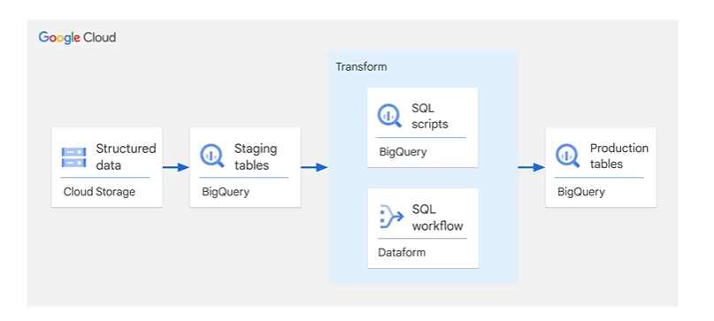
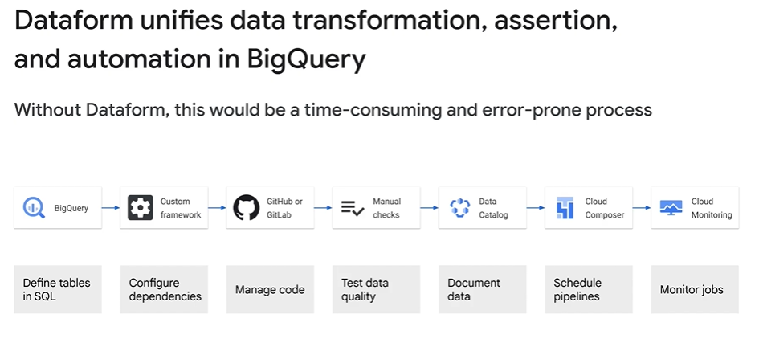
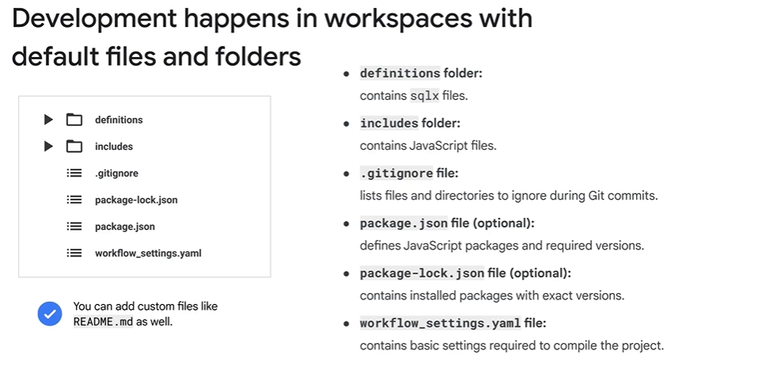
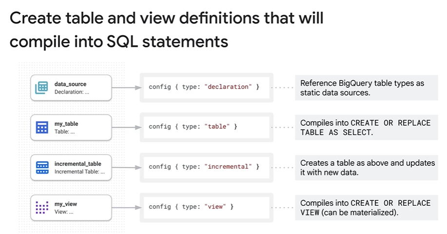
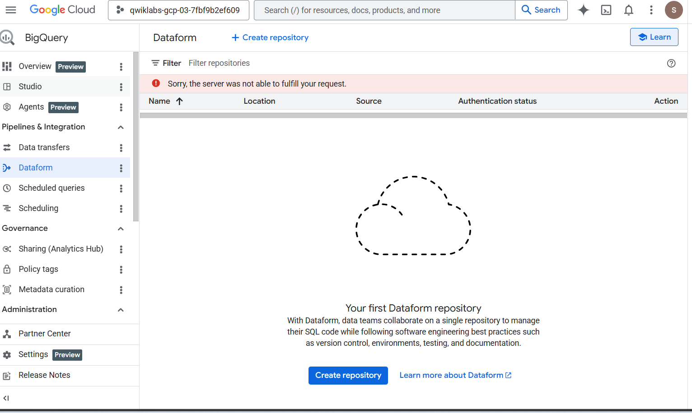
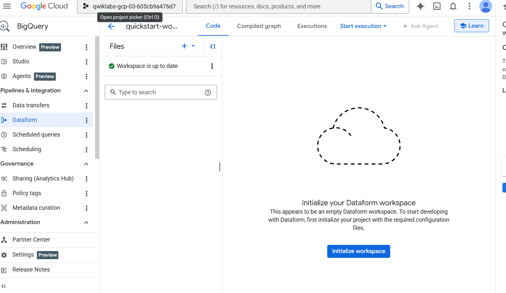
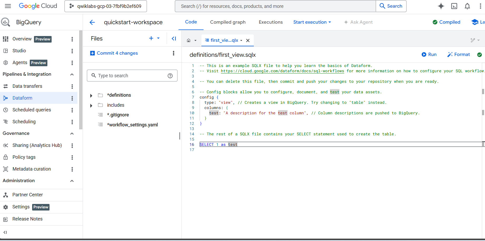
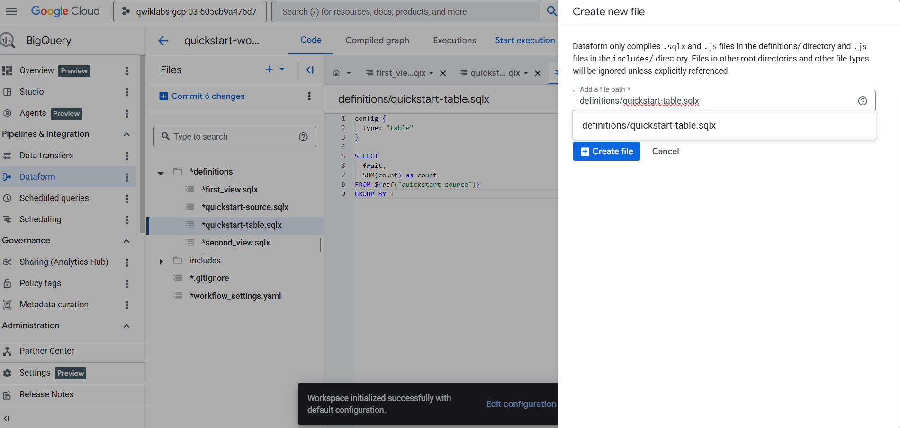
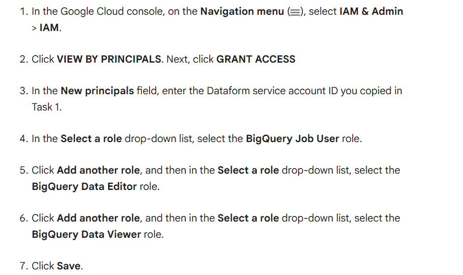

### Extract,Load and Transform (ELT) Architrecture



## Data forms

without data form



- Sql development and compilation run in Dataform, and workflow execution runs in Big Query.

Structure,



Create table and view  definitions that will compile into SQL Statements



# Lab

1.Create a Dataform repository



2. Create and initialize a Dataform development workspace





3. Create a SQLX file for defining a view



```txt

config {
  type: "view"
}

SELECT
  "apples" AS fruit,
  2 AS count
UNION ALL
SELECT
  "oranges" AS fruit,
  5 AS count
UNION ALL
SELECT
  "pears" AS fruit,
  1 AS count
UNION ALL
SELECT
  "bananas" AS fruit,
  0 AS count

```

4. Create a SQLX file for table definition

create file is same process as before,

```txt

config {
  type: "table"
}

SELECT
  fruit,
  SUM(count) as count
FROM ${ref("quickstart-source")}
GROUP BY 1

```

5. Grant Dataform access to BigQuery



IAM Permissions:


