### Extract,Transform and Load (ETL) Architrecture:

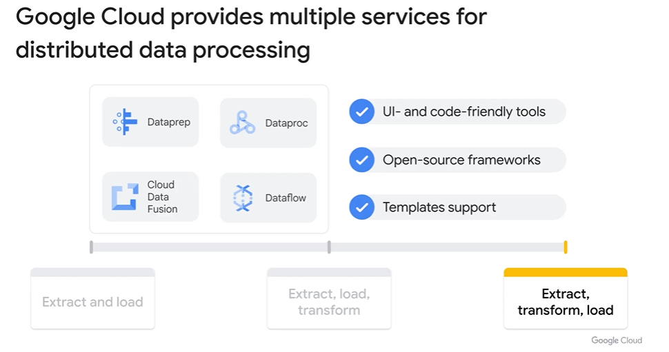


## Data Prep

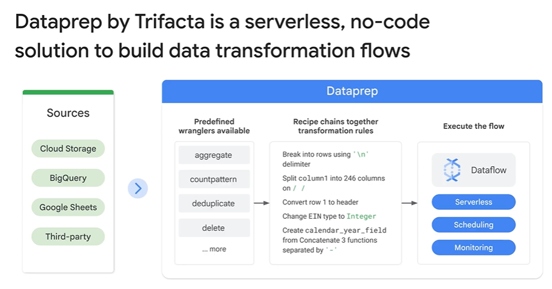

## Cloud Data Fusion

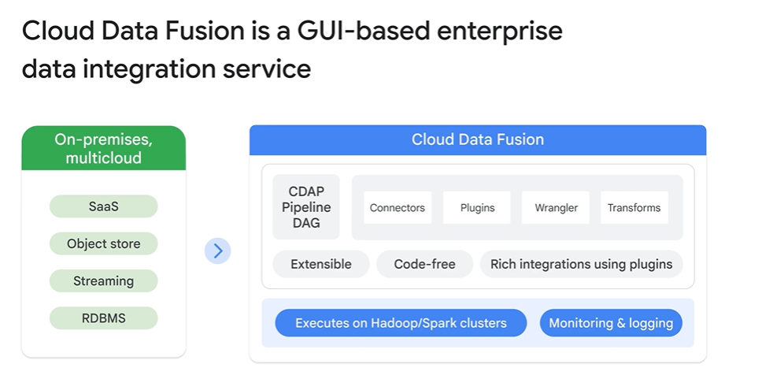

## Data Proc

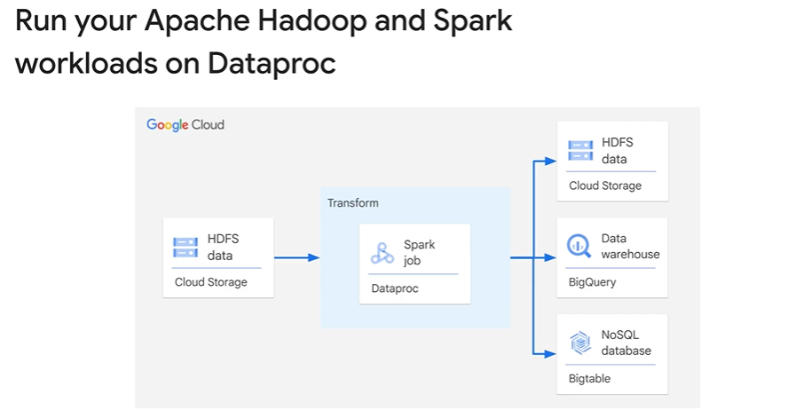

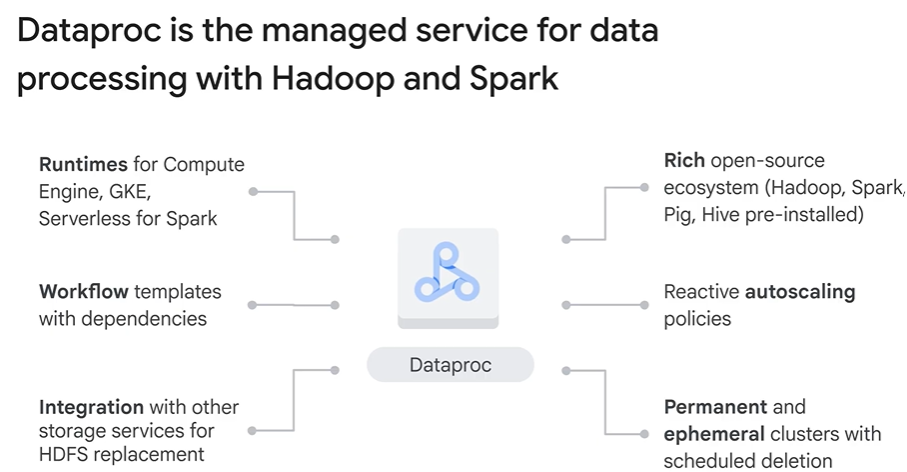

## Lab

Task 1. Complete environment configuration tasks
First, you're going to perform a few environment configuration tasks to support the execution of a Serverless for Apache Spark workload.

In the Cloud Shell, run the following command to enable Private IP Access:

```shell
gcloud compute networks subnets update default --region=us-east1 --enable-private-ip-google-access
```

Use the following command to create a new Cloud Storage bucket as a staging location:

```shell 
gsutil mb -p  qwiklabs-gcp-01-c2e4c436ab8a gs://qwiklabs-gcp-01-c2e4c436ab8a
```

Use the following command to create a new Cloud Storage bucket as temporary location for BigQuery while it creates and loads a table:

```shell
gsutil mb -p  qwiklabs-gcp-01-c2e4c436ab8a gs://qwiklabs-gcp-01-c2e4c436ab8a-bqtemp
```

Create a BQ dataset to store the data.

```shell
bq mk -d  loadavro
```

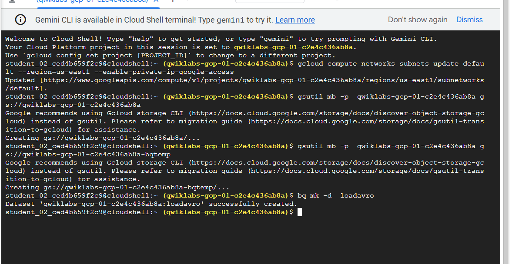

Task 2. Download lab assets
Next, you're going to download a few assets necessary to complete the lab into lab provided Compute Engine VM. You will perform the rest of the steps in the lab inside the Compute Engine VM.

From the Navigation menu click on Compute Engine. Here you'll see a linux VM provisioned for you. Click the SSH button next to the lab-vm instance.

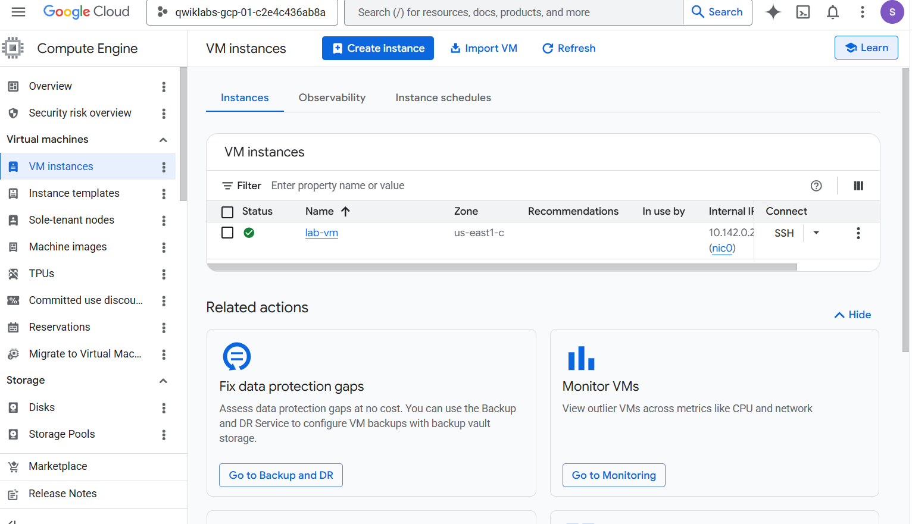

At the VM terminal prompt, download the Avro file that will be processed for storage in BigQuery.

```shell
wget https://storage.googleapis.com/cloud-training/dataengineering/lab_assets/idegc/campaigns.avro
```

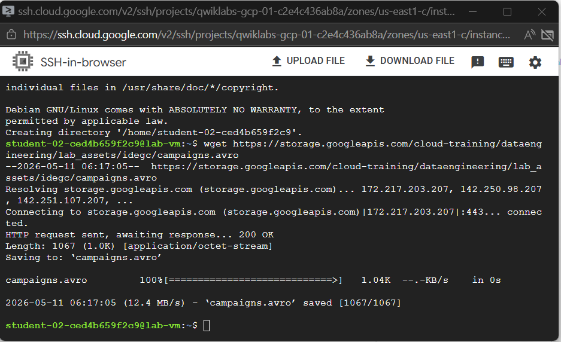

At the VM terminal prompt, download the Avro file that will be processed for storage in BigQuery.

```shell
wget https://storage.googleapis.com/cloud-training/dataengineering/lab_assets/idegc/campaigns.avro
```
Next, move the Avro file to the staging Cloud Storage bucket you created earlier.

```shell
gcloud storage cp campaigns.avro gs://qwiklabs-gcp-01-c2e4c436ab8a
```

Download an archive containing the Spark code to be executed against the Serverless environment.

```shell
wget https://storage.googleapis.com/cloud-training/dataengineering/lab_assets/idegc/dataproc-templates.zip
```

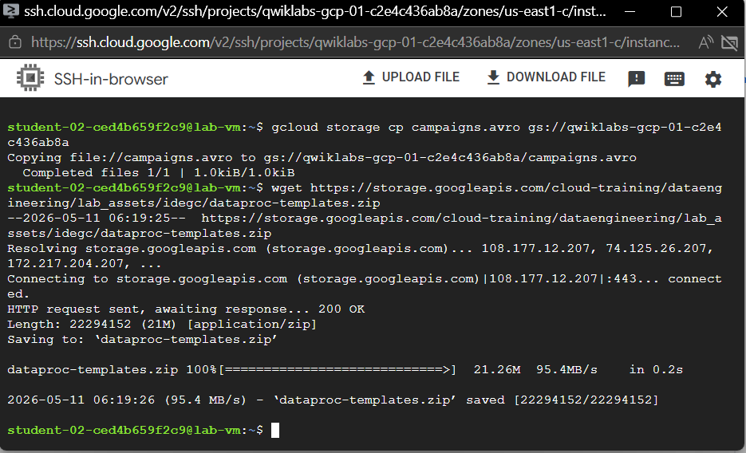

Extract the archive.

```shell
unzip dataproc-templates.zip
```

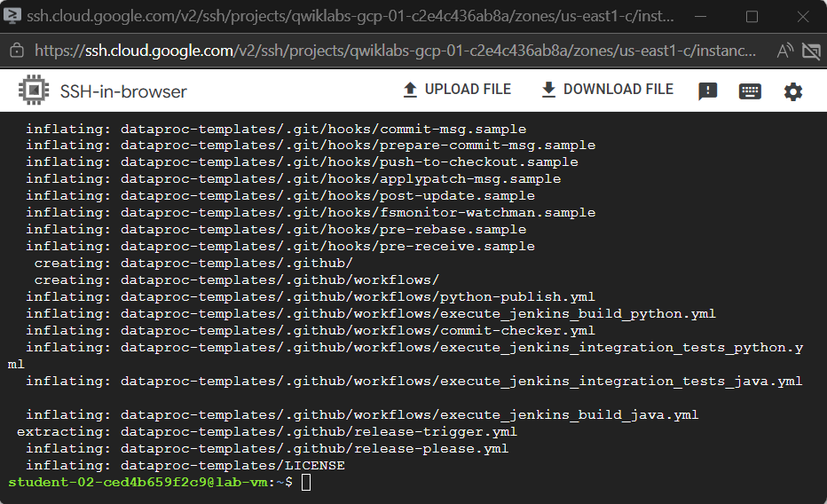

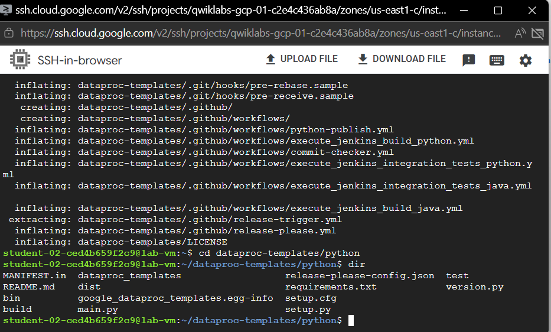

Task 3. Configure and execute the Spark code

Next, you're going to set a few environment variables into VM instance terminal and execute a Spark template to load data into BigQuery.

Set the following environment variables for the Serverless for Apache Spark environment.

```shell
export GCP_PROJECT=qwiklabs-gcp-01-c2e4c436ab8a
export REGION=us-east1
export GCS_STAGING_LOCATION=gs://qwiklabs-gcp-01-c2e4c436ab8a
export JARS=gs://cloud-training/dataengineering/lab_assets/idegc/spark-bigquery_2.12-20221021-2134.jar
```

Run the following code to execute the Spark Cloud Storage to BigQuery template to load the Avro file in to BigQuery.

```shell
./bin/start.sh \
-- --template=GCSTOBIGQUERY \
    --gcs.bigquery.input.format="avro" \
    --gcs.bigquery.input.location="gs://qwiklabs-gcp-01-c2e4c436ab8a" \
    --gcs.bigquery.input.inferschema="true" \
    --gcs.bigquery.output.dataset="loadavro" \
    --gcs.bigquery.output.table="campaigns" \
    --gcs.bigquery.output.mode=overwrite\
    --gcs.bigquery.temp.bucket.name="qwiklabs-gcp-01-c2e4c436ab8a-bqtemp"
```

Task 4. Confirm that the data was loaded into BigQuery
Now that you have successfully executed the Spark template, it is time to examine the results in BigQuery.

View the data in the new table in BigQuery.

```shell
bq query \
 --use_legacy_sql=false \
 'SELECT * FROM `loadavro.campaigns`;'
 ```
 