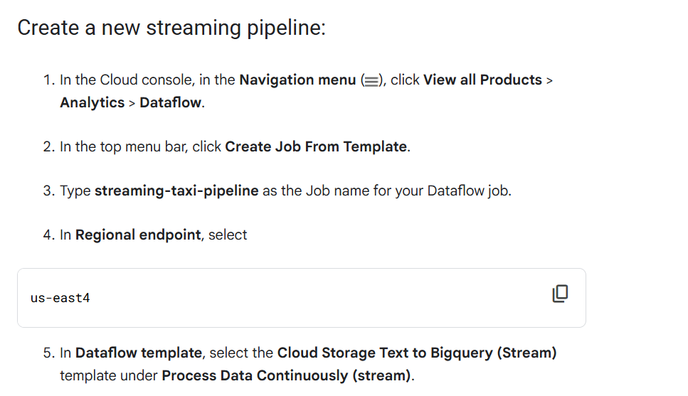
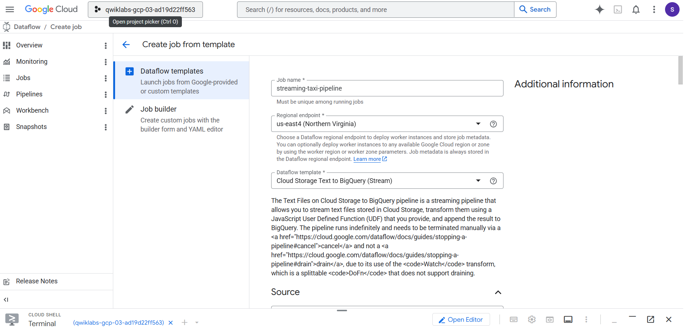
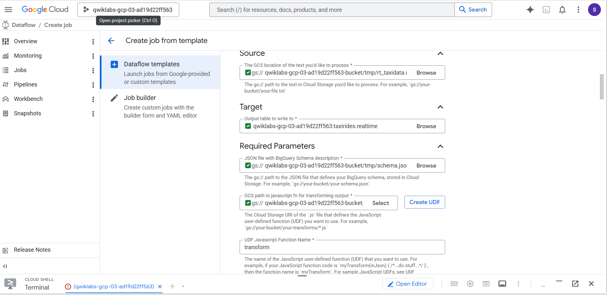
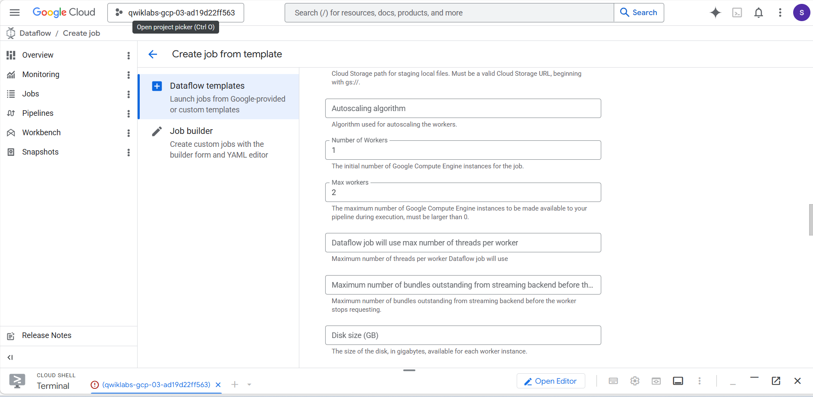
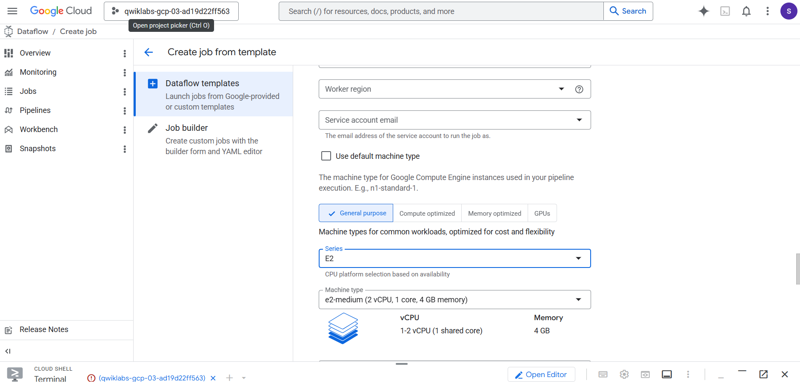
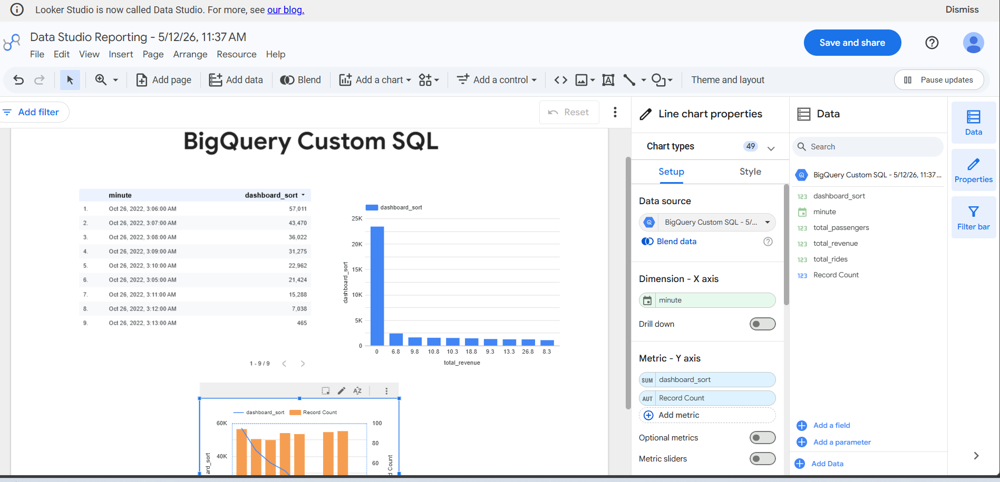

# Streaming Data pipiline for realtime dashboard with data flow

Task 1. Create a BigQuery dataset

I have done via Console UI as I did before,

AND SCHEMA:

```txt
ride_id:string,
point_idx:integer,
latitude:float,
longitude:float,
timestamp:timestamp,
meter_reading:float,
meter_increment:float,
ride_status:string,
passenger_count:integer
```

Option 2: The command-line tool

In Cloud Shell (Cloud Shell icon), run the following command to create the taxirides dataset.

```shell
bq --location=us-east4 mk taxirides
```

Run this command to create the taxirides.realtime table (empty schema that you will stream into later).

```shell
bq --location=us-east4 mk \
--time_partitioning_field timestamp \
--schema ride_id:string,point_idx:integer,latitude:float,longitude:float,\
timestamp:timestamp,meter_reading:float,meter_increment:float,ride_status:string,\
passenger_count:integer -t taxirides.realtime
```


Task 2. Copy required lab artifacts

Cloud Storage allows world-wide storage and retrieval of any amount of data at any time. You can use Cloud Storage for a range of scenarios including serving website content, storing data for archival and disaster recovery, or distributing large data objects to users via direct download.

A Cloud Storage bucket was created for you during lab start up.

In Cloud Shell (Cloud Shell icon), run the following commands to move files needed for the Dataflow job.

```shell
gcloud storage cp gs://cloud-training/bdml/taxisrcdata/schema.json  gs://qwiklabs-gcp-03-ad19d22ff563-bucket/tmp/schema.json
gcloud storage cp gs://cloud-training/bdml/taxisrcdata/transform.js  gs://qwiklabs-gcp-03-ad19d22ff563-bucket/tmp/transform.js
gcloud storage cp gs://cloud-training/bdml/taxisrcdata/rt_taxidata.csv  gs://qwiklabs-gcp-03-ad19d22ff563-bucket/tmp/rt_taxidata.csv
```

Task 3. Set up a Dataflow Pipeline

Restart the connection to the Dataflow API.
In the Cloud Shell, run the following commands to ensure that the Dataflow API is enabled cleanly in your project.

```shell
gcloud services disable dataflow.googleapis.com
gcloud services enable dataflow.googleapis.com
```

Create a new streaming pipeline:





Browse as it is  mentioned in lab doc,







Run Job.


CHeck on big query, from the result open in looker or data studio:



