# Automations patterns and Options for Pipeline


# Lab

## Task 1. Enable APIs
In this task, you enable the relevant APIs before you create the Cloud Run functions.

In Cloud Shell, run the following command to set your Project ID variable:

```shell
export PROJECT_ID=$(gcloud config get-value project)
```

Run the following commands to set the Region variable:

```shell
export REGION=us-east4
gcloud config set compute/region $REGION
```

Run the following commands to set the configuration variables:

```shell
gcloud config set run/region $REGION
gcloud config set run/platform managed
gcloud config set eventarc/location $REGION
```

Run the following commands to enable all necessary services:

```shell
gcloud services enable \
  artifactregistry.googleapis.com \
  cloudfunctions.googleapis.com \
  cloudbuild.googleapis.com \
  eventarc.googleapis.com \
  run.googleapis.com \
  logging.googleapis.com \
  pubsub.googleapis.com
```

Note: For Eventarc, It may take a few minutes before all of the permissions are propagated to the service agent

## Task 2. Set required permissions
In this task, you grant the default Compute Engine service account the ability to receive Eventarc events, and the Cloud Storage service agent the permission to publish messages to Pub/Sub topics, enabling event-driven workflows and storage-triggered actions.

In Cloud Shell, run the following command to set the PROJECT_NUMBER variable:

```shell
export PROJECT_NUMBER=$(gcloud projects describe $PROJECT_ID --format='value(projectNumber)')
```

Run the following command to grant the default Compute Engine service account within your project the necessary permissions to receive events from Eventarc:

```shell
gcloud projects add-iam-policy-binding $PROJECT_ID \
    --member="serviceAccount:$PROJECT_NUMBER-compute@developer.gserviceaccount.com" \
    --role="roles/eventarc.eventReceiver"
```

Run the following commands to retrieve the Cloud Storage service agent for your project, and grant it the permission to publish messages to Pub/Sub topics:

```shell
gcloud beta services identity create --service=storage.googleapis.com --project=$PROJECT_ID

gcloud projects add-iam-policy-binding $PROJECT_ID \
    --member="serviceAccount:service-$PROJECT_NUMBER@gs-project-accounts.iam.gserviceaccount.com" \
    --role='roles/pubsub.publisher'

``` 

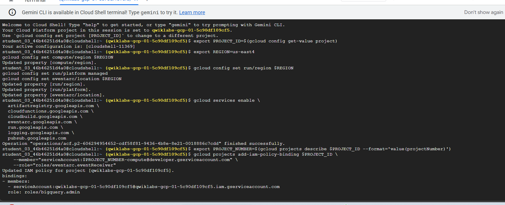

## Task 3. Create the function

In this task, you create a simple function named loadBigQueryFromAvro. This function reads an Avro file that is uploaded to Cloud Storage and then creates and loads a table in BigQuery.

In Cloud Shell, run the following command to create and open a file named index.js:

```shell
nano index.js
```

Copy the following code for the Cloud Function into the index.js file:

```js
/**
* index.js Cloud Function - Avro on GCS to BQ
*/
const {Storage} = require('@google-cloud/storage');
const {BigQuery} = require('@google-cloud/bigquery');

const storage = new Storage();
const bigquery = new BigQuery();

exports.loadBigQueryFromAvro = async (event, context) => {
    try {
        // Check for valid event data and extract bucket name
        if (!event || !event.bucket) {
            throw new Error('Invalid event data. Missing bucket information.');
        }

        const bucketName = event.bucket;
        const fileName = event.name;

        // BigQuery configuration
        const datasetId = 'loadavro';
        const tableId = fileName.replace('.avro', ''); 

        const options = {
            sourceFormat: 'AVRO',
            autodetect: true, 
            createDisposition: 'CREATE_IF_NEEDED',
            writeDisposition: 'WRITE_TRUNCATE',     
        };

        // Load job configuration
        const loadJob = bigquery
            .dataset(datasetId)
            .table(tableId)
            .load(storage.bucket(bucketName).file(fileName), options);

        await loadJob;
        console.log(`Job ${loadJob.id} completed. Created table ${tableId}.`);

    } catch (error) {
        console.error('Error loading data into BigQuery:', error);
        throw error; 
    }
};

```

In nano press (Ctrl+x) , and then press (Y), and then press Enter to save the file.

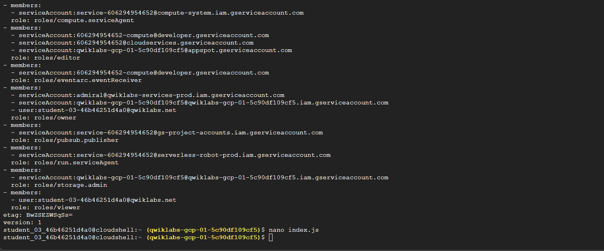

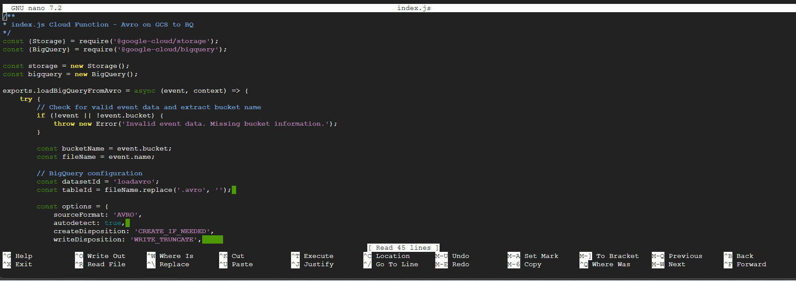

## Task 4. Create a Cloud Storage bucket and BigQuery dataset

In this task, you set up the background infrastructure to store assets used to invoke the Cloud Run function (a Cloud Storage bucket), and then store the output in BigQuery when it completes.

In Cloud Shell, run the following command to create a new Cloud Storage bucket as a staging location:

```shell
gcloud storage buckets create gs://$PROJECT_ID --location=$REGION
```

Run the following command to create a BQ dataset to store the data:

```shell
bq mk -d  loadavro
```

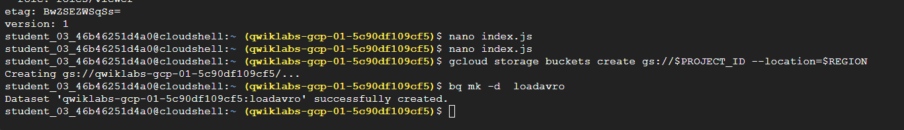

## Task 5. Deploy your function

In this task, you deploy the new Cloud Run function and trigger it so that the data is loaded into BigQuery.

In Cloud Shell, run the following command to install the two javascript libraries to read from Cloud Storage and store the output in BigQuery:

```shell
npm install @google-cloud/storage @google-cloud/bigquery
```

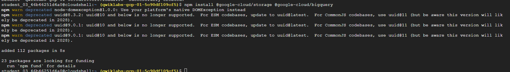

Run the following command to deploy the function:

```shell
gcloud functions deploy loadBigQueryFromAvro \
    --gen2 \
    --runtime nodejs24 \
    --source . \
    --region $REGION \
    --trigger-resource gs://$PROJECT_ID \
    --trigger-event google.storage.object.finalize \
    --memory=512Mi \
    --timeout=540s \
    --service-account=$PROJECT_NUMBER-compute@developer.gserviceaccount.com 
```

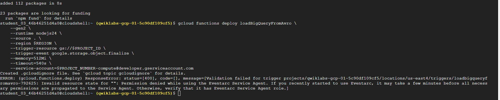

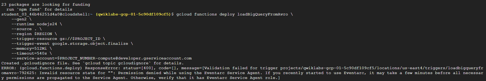

Note: If you see an error message relating to eventarc service agent propagation, wait a few minutes and try the command again.

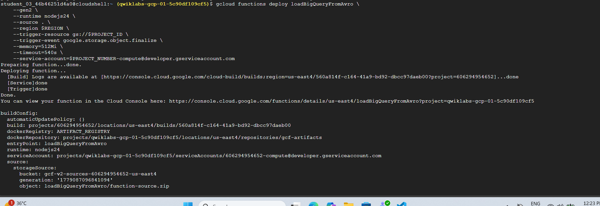

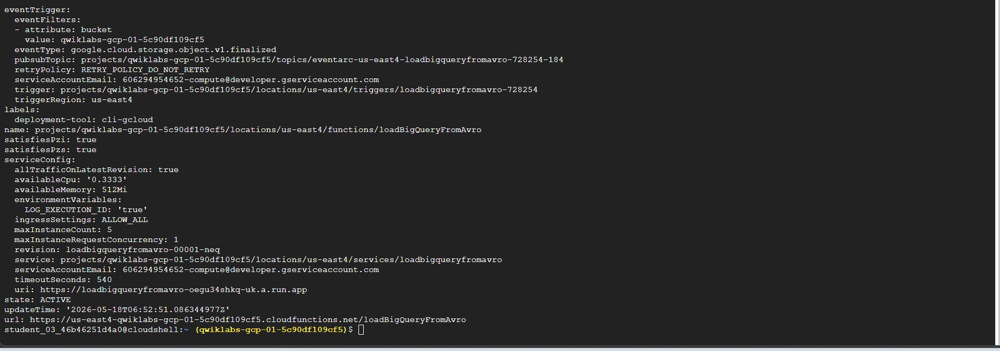

Run the following command to confirm that the trigger was successfully created. The output will be similar to the following:

```shell
gcloud eventarc triggers list --location=$REGION
```

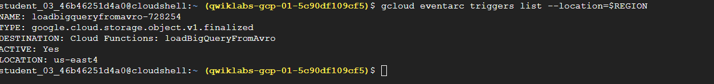

Run the following command to download the Avro file that will be processed by the Cloud Run function for storage in BigQuery:

```shell
wget https://storage.googleapis.com/cloud-training/dataengineering/lab_assets/idegc/campaigns.avro
```

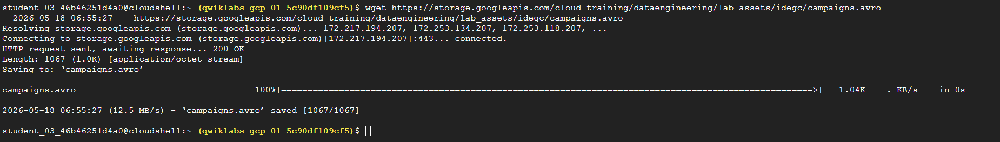

Run the following command to move the Avro file to the staging Cloud Storage bucket you created earlier. This action will trigger the Cloud Run function:

```shell
gcloud storage cp campaigns.avro gs://qwiklabs-gcp-01-5c90df109cf5
```

