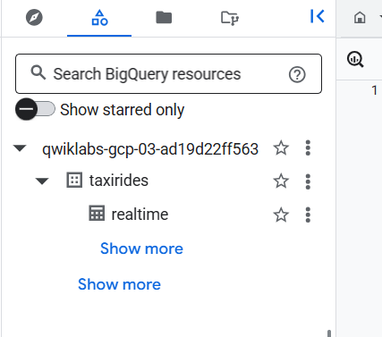

# Streaming Data pipiline for realtime dashboard with data flow

Task 1. Create a BigQuery dataset

I have done via Console UI as I did before,

AND SCHEMA:

```txt
ride_id:string,
point_idx:integer,
latitude:float,
longitude:float,
timestamp:timestamp,
meter_reading:float,
meter_increment:float,
ride_status:string,
passenger_count:integer
```

Option 2: The command-line tool

In Cloud Shell (Cloud Shell icon), run the following command to create the taxirides dataset.

```shell
bq --location=us-east4 mk taxirides
```

Run this command to create the taxirides.realtime table (empty schema that you will stream into later).

```shell
bq --location=us-east4 mk \
--time_partitioning_field timestamp \
--schema ride_id:string,point_idx:integer,latitude:float,longitude:float,\
timestamp:timestamp,meter_reading:float,meter_increment:float,ride_status:string,\
passenger_count:integer -t taxirides.realtime
```




